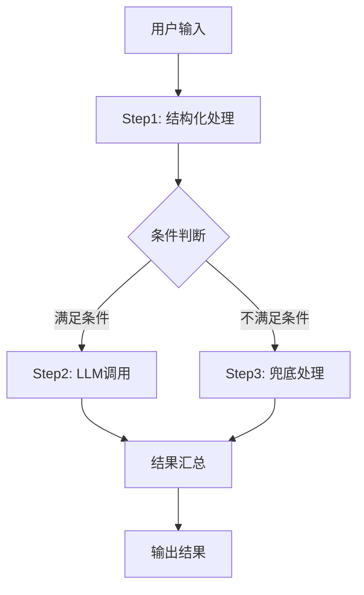

# skingflow.js 复杂工作流与多阶段流程

本节详细介绍如何用 skingflow.js 实现多阶段、分步、条件跳转等复杂 LLM 工作流，结合 PocketFlow/cookbook/pocketflow-workflow 迁移经验，帮助你设计可扩展、可维护的自动化流程。

---

## 场景与目标
- 适用于需要多步推理、阶段性处理、条件分支的 LLM 应用（如文档生成、复杂问答、多轮对话等）。
- 目标是让每个流程节点职责单一、可组合，主流程灵活跳转。

## 核心原理与流程图
- 每个节点实现为 async generator，主流程通过状态变量 next 跳转。
- 全局 context/shared 对象贯穿流程，节点间共享数据。

**典型流程结构：**



> 注：如不支持 mermaid，可用文本描述：
> 用户输入→Step1→条件判断→Step2/Step3→结果汇总→输出

## 关键节点结构说明
- **Step1Node**：前置处理/结构化输入
- **Step2Node**：核心 LLM 调用，支持流式输出
- **Step3Node**：异常/兜底处理
- **WorkflowNode**：主流程调度，状态机式跳转

## 典型代码片段（含注释）
```js
// nodes.js
export async function* Step1Node(shared) {
  // ... 预处理逻辑
  shared.preprocessed = 'xxx';
  yield 'Step1 done\n';
  return 'step2';
}

export async function* Step2Node(shared) {
  // ... LLM 调用，可用 callLLMStream
  for await (const token of callLLMStream(shared.preprocessed)) {
    yield token;
  }
  return 'done';
}

export async function* Step3Node(shared) {
  yield 'Fallback...';
  return 'done';
}

export async function* WorkflowNode(shared) {
  let next = 'step1';
  while (next) {
    switch (next) {
      case 'step1':
        next = await Step1Node(shared);
        break;
      case 'step2':
        next = await Step2Node(shared);
        break;
      case 'step3':
        next = await Step3Node(shared);
        break;
      default:
        next = null;
    }
  }
}
```

## 易错点与注意事项
- 每个节点必须 async generator 并 yield，否则主流程流式失效。
- 节点 return 下一个状态字符串，主流程 while(next) 跳转。
- shared/context 用于节点间传递变量。
- 条件分支可在节点内部 return 不同 next 状态。
- 日志建议可控，避免污染最终输出。

## PocketFlow 迁移经验
- Python 版通常用类+方法，js 推荐用 async generator + export。
- skingflow.js 强调 ESM 规范，import/export 不可与 require 混用。
- 代理、环境变量、流式输出等建议参考 skingflow-agent 经验总结。

## 实践建议/扩展思路
- 可将每个阶段节点拆分为独立文件，便于维护。
- 支持流程中动态插拔节点，实现插件化。
- 复杂流程建议画流程图梳理节点依赖关系。
- 可结合 MCP、RAG、多智能体等高级能力，构建更复杂的自动化系统。
